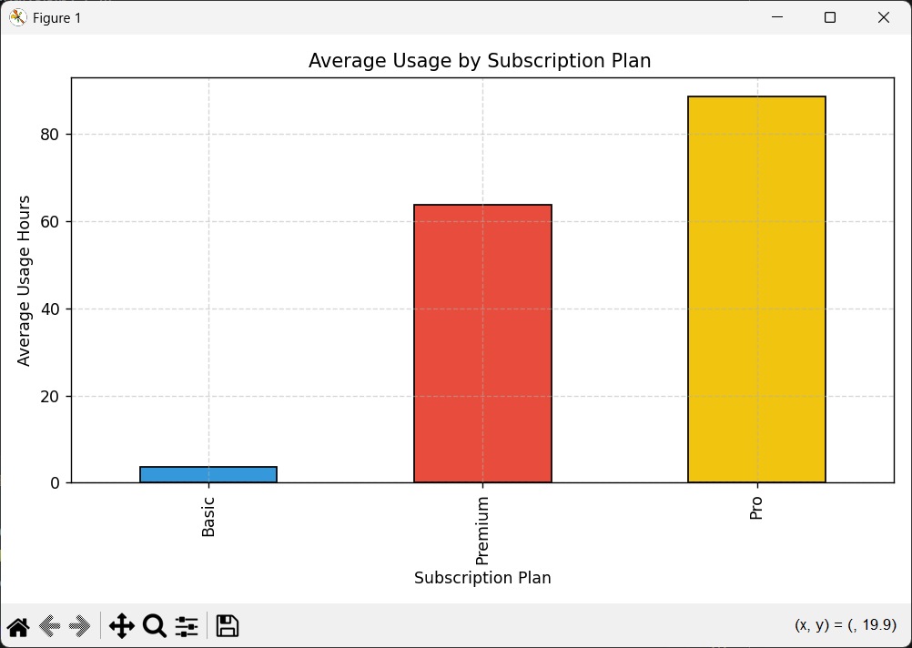
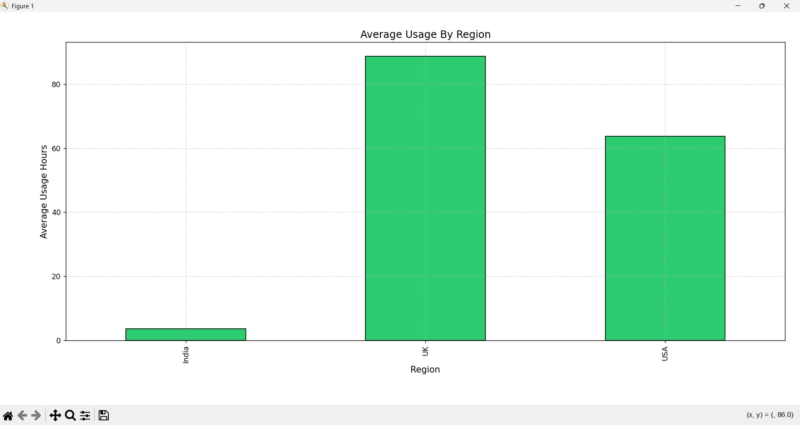
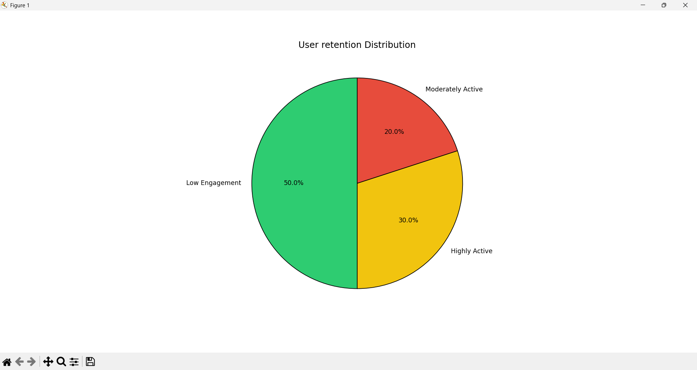
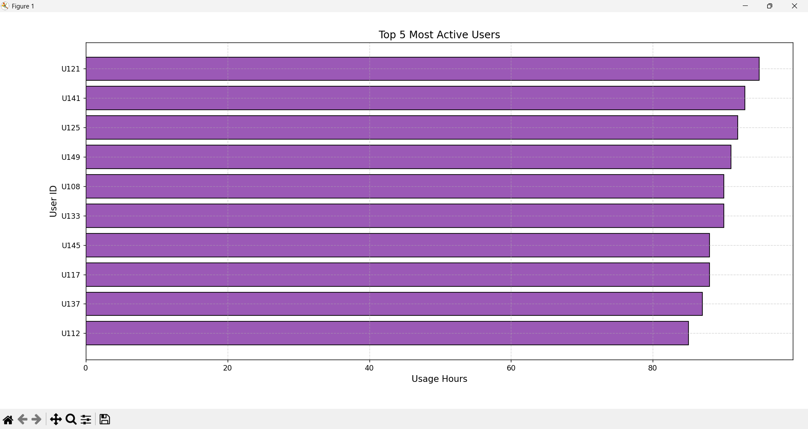
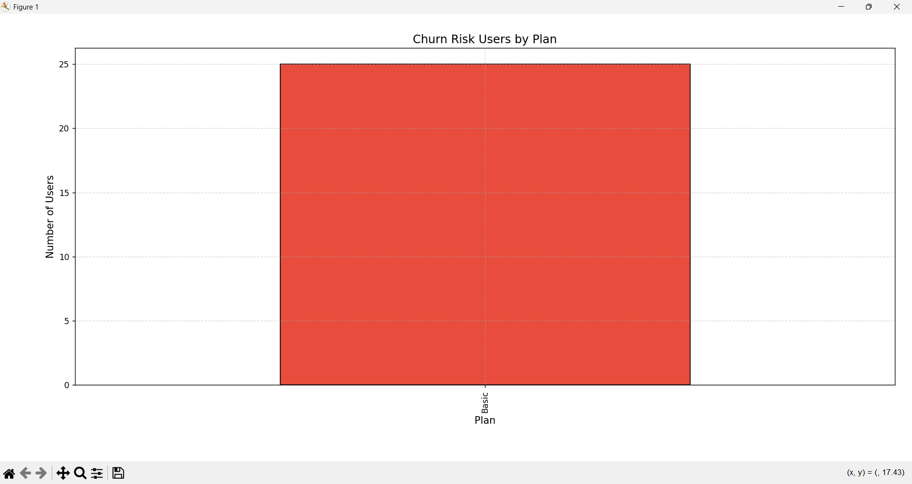
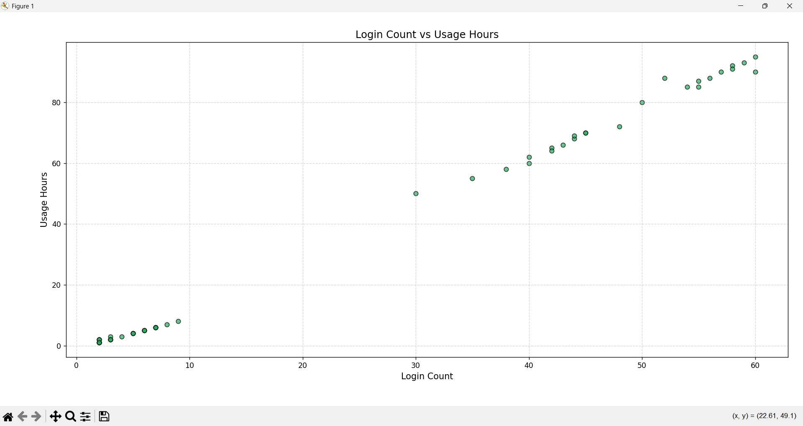
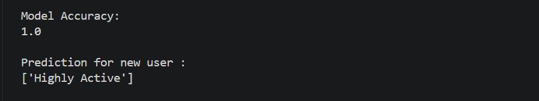
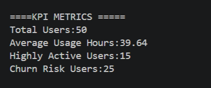
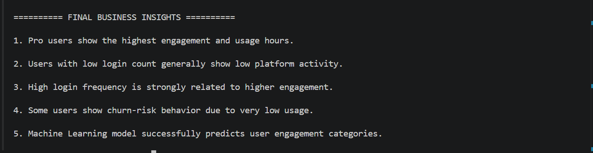

# User Engagement & Retention Data Analysis using Python and Machine Learning

## Project Description

This project is a complete Data Analysis and Machine Learning system developed to analyze user engagement and retention behavior on a digital platform.

The main goal of this project is to understand how users interact with the platform by analyzing:
- subscription plans
- login frequency
- usage hours
- user retention behavior
- churn-risk users

The project uses Python, MySQL, Pandas, Matplotlib, and Machine Learning techniques to generate business insights and visual analytics.

This system helps businesses:
- identify highly active users
- detect low engagement users
- understand customer retention patterns
- predict user engagement categories using Machine Learning

---

# Technologies Used

- Python
- MySQL
- Pandas
- Matplotlib
- Scikit-learn

---

# Project Features

## User Engagement Analysis
Analyzes user activity using:
- Login Count
- Usage Hours
- Subscription Plans
- Region-wise engagement

---

## Subscription Plan Analysis
Compares average usage hours across:
- Basic Plan
- Premium Plan
- Pro Plan

---

## Region-wise Analysis
Analyzes user engagement patterns based on different regions.

---

## Retention Categorization
Users are categorized into:
- Highly Active
- Moderately Active
- Low Engagement

based on their usage hours.

---

## Churn Risk Detection
Identifies users with very low engagement who may stop using the platform.

---

## KPI Metrics
The system calculates important business metrics such as:
- Total Users
- Average Usage Hours
- Highly Active Users
- Churn Risk Users

---

## Correlation Analysis
Analyzes the relationship between:
- Login Count
- Usage Hours

to understand how user activity affects engagement.

---

## Machine Learning Prediction
A Decision Tree Classifier model is used to predict user engagement category using:
- Login Count
- Usage Hours

The model predicts whether a user is:
- Highly Active
- Moderately Active
- Low Engagement

---

# Dataset Information

The dataset contains:
- User ID
- Subscription Plan
- Signup Date
- Last Login Date
- Usage Hours
- Login Count
- Region

---

# Data Visualizations

## Subscription Plan Analysis

---

## Region-wise Usage Analysis

---

## Retention Distribution

---

## Top Active Users

---

## Churn Risk Analysis

---

## Login Count vs Usage Hours

---

# Machine Learning Output

---

# KPI Metrics Output

---

# Final Business Insights

---

# Key Business Insights

- Pro users showed the highest engagement and usage hours.
- High login frequency strongly increased platform activity.
- Several users showed churn-risk behavior due to low engagement.
- User engagement patterns varied across subscription plans and regions.
- Machine learning successfully predicted user engagement categories.

---

# Future Improvements

- Power BI Dashboard
- Real-time analytics
- Advanced machine learning models
- Web dashboard integration
- Automated reporting system

---

# Author

Abhijith
